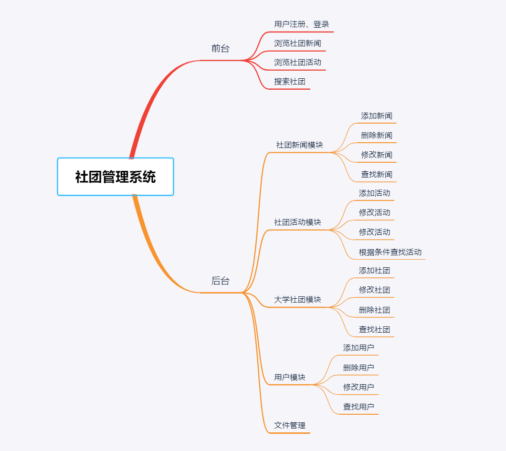
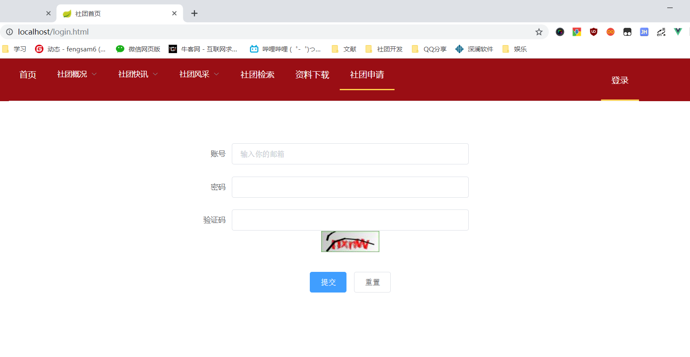
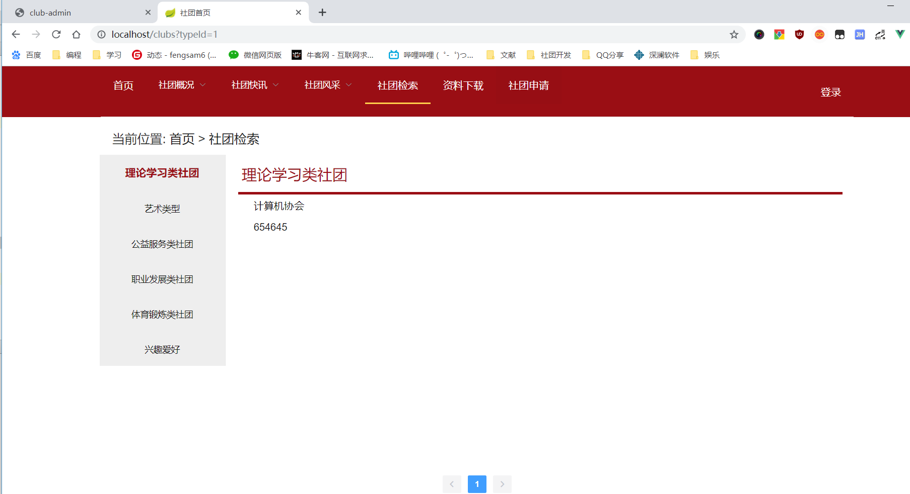
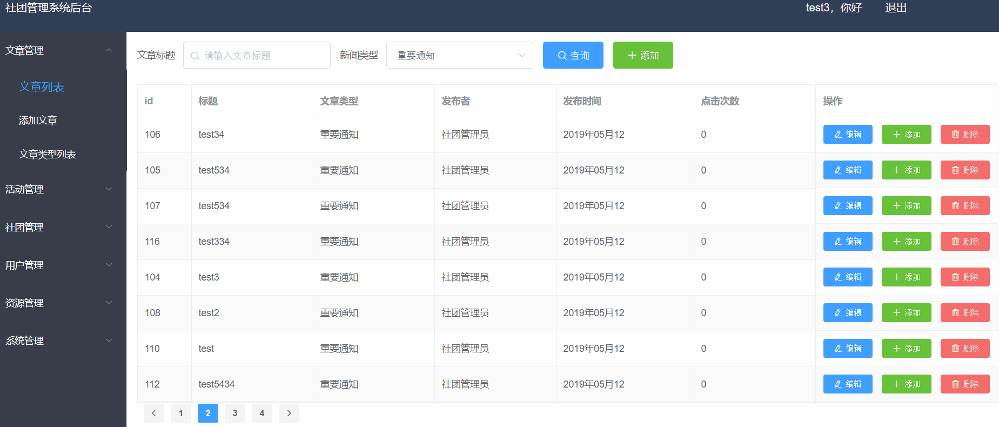

# 一.社团管理系统

## 1.介绍
基于前后端分离开发方式，使用Spring Boot、vue等技术开发社团管理系统。系统功能如下图所示。

## 2.系统设计
系统设计说明

1. 后端使用Spring boot、mybatis、redis、mybatisPlus，系统架构如下图所示

## 3. 后端开发简介

* 系统后端多模块开发

* 模块Association-generation支持代码生成，基于MyBatis-Plus代码生成器，运行该模块main方法Generator，能够生成Dao层、service层通用代码，可以提高后端开发效率。
* association-core 提供一些常用工具类，spring全局异常配置、定义后端rest接口返回json数据格式、redis工具类配置，springboot跨域处理。
* 模块Association-API调用模块Association-service，提供前台访问RESTful接口。
* 模块Association-admin调用模块Association-service，提供后台访问RESTful接口。

后端开发工具idea，系统maven多模块，如下图。

## 4. 前端简介

* 前台页面单独开发一个工程vue-club，所有前台页面代码都写在vue-club中.

  

* 后台页面单独开发一个工程club-admin，所有前台页面代码都写在club-admin中.

## 5. 系统运行效果

* 系统登录页面

* 前台活动列表页面

+ 前台社团检索页面页面

* 后台新闻列表页面

* 后台社团列表页面

## 6. 系统启动

* 社团系统采用前后端分离开发方式，系统启动方式可以参考如下。
*  6.1 安装系统软件依赖。后端需要安装java、maven、mysql、redis、nginx，建议开发工具使用idea。
* 6.2.  启动检查。数据库MySQL、Redis是否启动，执行根目录sql脚本。
* 搭建文件服务器。项目中，使用nginx作为文件服务器，请下载nginx，并且修改ngix配置文件。nginx配置文件可以参考/doc/ngxin_config/dev/nginx.conf。请访问http://127.0.0.1:8013/fileServer/ ，检查文件服务器，是否配置有效。
* 6.3.  从github（或者码云）下载代码，修改mysql、redis数据库连接用户名、密码。
* 6.4. 使用idea导入association代码，点模块association-adminAPI 中AssociationAdminApplication—>main方法，就可以启动adminassociation-admin接口，同理可以association-restAPI接口。
* 如果打包使用maven启动，进入项目根目录，在cmd窗口执行mvn package，将所有模块打包成jar，可以参考deployment文件夹
* 6.6.  启动前端。进入club、club-admin根目录（该目录位置有package.json），打开cmd窗口，输入命令npm run dev运行vue-club、club-admin。

## 7. 浏览器访问测试

1. http://127.0.0.1:80/>   本地运行，系统前台访问页面
2. http://127.0.0.1:8080/>   本地运行，系统后台访问页面
3. http://127.0.0.1:8081/club/api/swagger-ui.html>   前台接口访问文档
4. http://127.0.0.1:8082/club/admin/swagger-ui.html>  后台接口访问文档

##  8.系统设计

1. 系统模块设计及技术选择。

* 后端使用maven构建五个模块模块，使用Spring Boot 、springMVC、mybatis、mybatisPlus、pageHelper、Redis等技术开发。使用 swagger UI生成后端接口API文档，可以直接在浏览器浏览。
* 前端使用Vue、Vue router、vue Axios、Element UI等技术开发。

2. 开发方式前后端分离。

* 前后代码端耦合度低，可以单独部署测试，有利于后期维护。

3. 数据库持久层，使用MySQL存储数据，采用Redis缓存数据。

* Redis基于内存非关系数据库，读写速度非常快，提高系统数据读写速速。系统使用redis记录登录后的token。

4. 系统登录，采用动态token验证身份，后端所有操作，必须提供token才能访问。

* 用户输入正确的用户名、密码，请求登录接口，后端会返回一个随机的token（64位uuid），同时系统后端将uuid最为key，值为用户ID，存储Redis数据库中，同时设置键数据库有效时间40分钟。后端有一个拦截器拦截用户所有请求，会根据前台传入token去redis数据库查找，只有token正确，才能在redis查找到用户id，系统才放行。

5. 使用nginx作为文件服务器

* 配置nginx，可以/doc/ngxin_config/dev/nginx.conf。使用nginx作为文件服务器，默认地址：http://127.0.0.1:8013/fileServer/ 。

